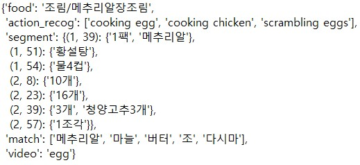
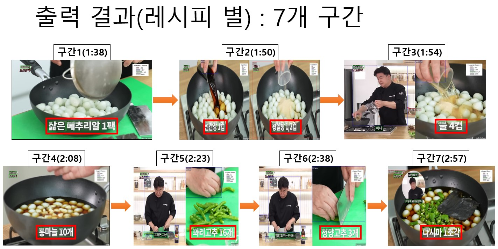

# Cook-Video_Analysis

Using AI of CV, Analysis Cook-Video like Paik's Cuisine, 백종원의 요리 비책

**[Jaechan Jo](mailto:jjc123a@naver.com)**

Multi Media System Lab, Sogang AI Research.

## Sample Results
### Overview
In order to utilize the scattered cooking videos, metadata and section tagging are carried out through an artificial intelligence


- [🦆 여보 여기 있던 내 알 못 봤어요│메추리알 장조림](https://youtu.be/RmZyxKOUbfs), 백종원의 쿠킹로그, 백종원의 요리비책

  - Video Image

    
    
  - Output Result

    

  - no residual block

    
  
  
  
## Model

### 1. Sogang-mmlab
  - [JinhaSong/analysis-engine](https://github.com/JinhaSong/analysis-engine)
      - hidf-engine-food_main : Food obj-detection(Yolov4 + Efficientnet)
      - hidf-engine-scenetext_main : Scene text recognition(CRAFT_pytorch)

### 2. Vision Analysis
  - Classification
    - food classification
>   - **YOLOv4**: MS COCO Dataset (related with food) e.g) 'bowl', ‘wine glass’, ‘cup’, ‘fork’, knife’, ‘spoon’…
>   - **EfficinetNet**: AI hub, KIST (주)휴먼ICT, 2017, [한국 이미지(음식)](https://aihub.or.kr/aihubdata/data/view.do?currMenu=115&topMenu=100&aihubDataSe=realm&dataSetSn=79)

  - Action_recognition
    - [**MMAction2**](https://github.com/open-mmlab/mmaction2)
>  - Kinetics400
>  - label related with food e.g) ‘cooking egg’, ‘cooking chicken’, 'breading or breadcrumbing' …

<br/><br/>
### - action_recognition

  - Hyper-parameter description

>   - ```video_path```**(str)**: action_recognition 돌릴 영상 주소 e.g) '/home/Cook_Video_Analysis/Dataset/meat.mp4'
>   - ```sav_dir```**(str)**: 구간 분할한 영상 저장할 경로 e.g) '/home/Cook_Video_Analysis/Dataset/segment/'
>   - ```config_file```**(str)**: action_recognition config(module) e.g) 'configs/recognition/tsn/tsn_r50_video_inference_1x1x3_100e_kinetics400_rgb.py'
>   - ```checkpoints_file```**(str)**: weight check point 주소 e.g) 'checkpoints/tsn_r50_1x1x3_100e_kinetics400_rgb_20200614-e508be42.pth'
>   - ```device```**(str)**: 사용할 device e.g) 'cuda:0' or 'cpu'
>   - ```topk```**(int)**: 몇 개의 빈도수 상위 태그를 뽑을 것인지 e.g) 3
>   - ```split```**(bool)**: default=False, 영상 분할을 할 것인지, False시 통 영상 채로 분석 결과 도출 e.g) False
>   - ```segment_sec```**(int)**: default=None, 몇 초씩 구간 분할을 할 것인지 e.g) 10
>   - ```fourcc```**(str)**: default=None, four character code : 코덱, 압축 방식, 색상, 픽셀 포맷 등을 정의하는 정수 값 e.g) 'mp4v'


## Idea

### 3. Text Analysis
  - Segmentation of Video
    - font_height_to_segmentation
>   - 편집자가 편집할 때, **특정 장면에 특정 자막**을 사용한다.
>   - 특히, **자막의 높이**가 고유한 값으로, 이를 통해 구간 분할 및 태그 목록을 생성한다.
>   - 거꾸로, 편집을 할 때, 분할하고자 하는 지점에는 특정한 크기의 자막을 달도록 할 수 있다.


  - Ingredient Tags
    - text_simple_match
>   - filtered by whether they are **completely matched or not**, e.g) '메추리알' == '메추리알 : True, '메치루알' != '메추리알': False
>   - matching Ingredient DB (source: 소스산업화센터, [식재료 DB](https://sauce.foodpolis.kr/home/index.do))

<br/><br/>
### - font_height_to_segmentation

  - Hyper-parameter description

>   - ```data```**(json)**: scene_text_recognition result, e.g) result_30
>   - ```video_name```**(str)**: video name without the file extension like .mp4, e.g) 'bundaegi', 'egg', 'nuddle'
>   - ```score```**(float)**: scentxt_score, e.g) 0.7
>   - ```fh_low```**(int)**: font_height_low, e.g) 125
>   - ```fh_high```**(int)**: font_height_high, e.g) 140
>   - ```freq```**(int)**: frequency of text_bboxes per frame, e.g) 10
>   - ```fps```**(int)**: frame per second, e.g) 30
>   - ```find_range```**(int)**: take text_result for time of find_range from segment start time, e.g) 3


### - text_simple_match

  - Hyper-parameter description

>   - ```data```**(list)**: 질의할 preprocessed scenetext 분석 결과, e.g) egg_text (= preprocess(data=result_30, score=0.9, video_name='egg', module_name='scenetxt'))
>   - ```db```**(Dataframe)**: 매칭할 데이터 베이스 e.g) 식재료 데이터 베이스, df (= pd.read_csv('./Dataset/dataset/refined/ingredients.csv', encoding = 'cp949' ))
>   - ```topk```**(int)**: 몇 개의 빈도수 상위 태그를 뽑을 것인지 e.g) 5


## Setup

### Docker compose

```docker run --gpus all -itd -e LC_ALL=C.UTF-8 --name cook_video_analysis -v"[gpu server dir]":/workspace/ -p 22000:8888 -p 22001:8097 -p 22002:22 nvcr.io/nvidia/pytorch:21.07-py3 /bin/bash```

  > - **docker name(이름 정의)**: e.g.) cook_video_analysis
  > - **gpu server dir(도커 가상환경에 연결할 GPU 서버 폴더 경로)**: git clone dir(깃클론한 폴더 경로를 넣어주세요) e.g.) /media/mmlab/hdd3/Cook-Video_Analysis/
  > - **mounted docker dir(연결된 도커 폴더 경로)**: e.g.) /workspace/
  > - **port forwading(포트 설정)**: e.g.) 20000:8888(jupyter), 20001:8097(visdom), 20002:22(ssh)
  > - **docker image(도커 이미지)**: e.g.) nvcr.io/nvidia/pytorch:21.07-py3
  
  
  
## Inference code


### Input Video, Output Analysis_Result

1. cook_video_analysis.py
  
  ```
  video_tags = cook_video_analysis(module, video_path, fps, db, device, sav=sav, split=split, seg_dir=seg_dir, \
                                   font_text_score=font_text_score, fh_low=fh_low, fh_high=fh_high)
  ```

2. cook_video_analysis_dir.py

  ```
  video_dir_tags = cook_video_analysis_dir(module, video_dir, video_format, result_dir, fps, db, device, \
                                           sav=sav, split=split, font_text_score=font_text_score)
  ```

3. cook_video_analysis_multi_dir.py 

  ```
  video_dir_tags = cook_video_analysis_multi_dir(module, video_dir, video_format, result_dir, fps, db, font_dict, device, \
                                                 sav=sav, split=split, font_text_score=font_text_score)
  ```
  
